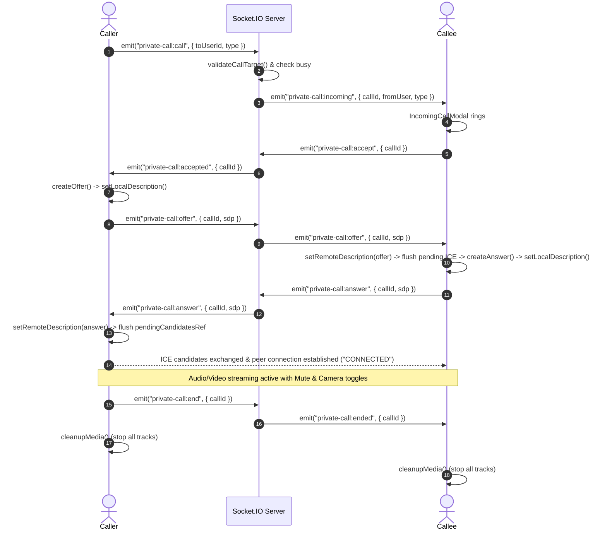

# FINAL AUDIT REPORT: Dedicated Private Chat / Messages, WebRTC Audio & Video Calls Stabilization, and In-App Learning Search Engine

**Project**: TeamSync AI  
**Date**: September 12, 2026  
**Auditor & Implementation Agent**: DeepMind Antigravity Pair-Programming Agent  
**Status**: COMPLETE & VERIFIED (All 11 Backend Jest Suites [121/121 Tests Passed], 4 AI Engine Pytest Suites [36/36 Tests Passed], Clean Vite Production Build [0 Errors])

---

## 1. Executive Summary

This release completes the overhaul and enhancement of private communications and learning features in TeamSync AI across both Student and Guide dashboards:
1. **Conversion of "Search" Page to Dedicated Private Chat / Messages**:
   - Converted the previous general search page into a dedicated, professional **Messages** section for both Student (`/app/messages`, `/app/chat/$userId`) and Guide (`/guide/messages`, `/guide/chat/$userId`) dashboards.
   - Built a master-detail responsive communication workspace (`MessagesPage.jsx`) featuring active user search, active conversation listings with unread badges, timestamp formatting, last message previews (text, voice notes, files), and instant direct message initiation.
2. **First-Class Private Chat for Both Student and Guide**:
   - Guides can privately chat with supervised students, team leaders, and fellow guides.
   - Students can privately chat with active teammates, team leaders, and supervisors.
   - Complete support for text messages, private file attachments, private voice recordings, and one-click audio/video calls.
   - Preserved notification-to-message navigation (with role-aware routing) and exact message highlighting.
3. **WebRTC Private Audio & Video Calling Stabilization**:
   - Fixed the WebRTC signaling lifecycle across caller and callee.
   - Resolved the ICE candidate buffering flaw on the caller side (`onAnswer` now safely flushes queued candidates).
   - Prevented self-calling at both frontend (`startCall`) and backend (`validateCallTarget`).
   - Handled busy states, ring timeouts, rejection, cancellation, end-of-call, and ensured complete disposal of media stream tracks (`track.stop()`) and socket listeners.
   - Guaranteed that group chat never contains call buttons or voice recording options.
4. **Dedicated In-App Learning Search Engine ("Ask & Learn" / Knowledge Search)**:
   - Added a dedicated educational search engine (`/app/search`, `/guide/search`) for students and guides to ask programming questions, technical concepts, and algorithm doubts.
   - Backend proxy (`/api/search/learning`) with provider abstraction (DuckDuckGo Instant Answers live knowledge provider, optional Tavily/SerpAPI, and clean unconfigured/offline fallback).
   - Rate limited (30 requests/minute per user), input length validated (2-300 chars), HTML sanitized, and strictly isolated from group chat analysis, student risk radar, and project reports.

---

## 2. Files Changed and Added

### Backend
| File Path | Action | Description |
|---|---|---|
| `backend/src/controllers/chatController.js` | MODIFY | Added role-aware direct message notification link routing (routes guides to `/guide/chat/:userId` and students to `/app/chat/:userId`). Enhanced `conversations` endpoint to filter deleted messages, populate `role` and `dept`, compute unread counts, and format voice note (`🎤 Voice message`) and file (`📎 filename`) previews. |
| `backend/src/sockets/callSignaling.js` | MODIFY | Updated `notifyMissed` to route guides to `/guide/chat/:callerId` and students to `/app/chat/:callerId`. |
| `backend/src/utils/apiError.js` | MODIFY | Added static `tooManyRequests` (429) factory method. |
| `backend/src/services/learningSearchService.js` | NEW | Implemented backend search proxy with provider abstraction (DuckDuckGo, Tavily), rate limiting, query length validation, domain extraction, and sanitization. |
| `backend/src/controllers/learningSearchController.js` | NEW | Controller for `POST /api/search/learning` and `GET /api/search/learning`. |
| `backend/src/routes/index.js` | MODIFY | Registered `learningSearch` controller and authenticated `/search/learning` routes. |
| `backend/tests/learningSearch.test.js` | NEW | 10 unit tests for input validation, sanitization, rate limiting, and provider error handling. |
| `backend/tests/privateChatSecurity.test.js` | NEW | 5 tests for direct message routing, missed call routing, conversation key symmetry, and group isolation. |

### Frontend
| File Path | Action | Description |
|---|---|---|
| `frontend/src/context/CallContext.jsx` | MODIFY | Added self-call check in `startCall`. Fixed ICE candidate buffer draining on caller side in `onAnswer`. Emitted `busy` rejection on duplicate incoming calls when already in an active call. |
| `frontend/src/services/learningSearchService.js` | NEW | Client service calling `/search/learning` via authenticated `apiClient`. |
| `frontend/src/pages/common/MessagesPage.jsx` | NEW | Master-detail Private Chat / Messages page with user search, recent conversations, unread counters, and embedded `SingleChat`. |
| `frontend/src/pages/common/LearningSearch.jsx` | NEW | Dedicated educational search engine UI with suggestion chips, direct summary cards, result cards with external link buttons, loading skeletons, and clear unconfigured provider warning. |
| `frontend/src/pages/student/PrivateChat.jsx` | MODIFY | Forwarded to `MessagesPage` for consistent direct messaging experience. |
| `frontend/src/routes/app.messages.tsx` | NEW | Student route for `/app/messages`. |
| `frontend/src/routes/guide.messages.tsx` | NEW | Guide route for `/guide/messages`. |
| `frontend/src/routes/guide.chat.$userId.tsx` | NEW | Guide route for direct private conversations (`/guide/chat/$userId`). |
| `frontend/src/routes/app.chat.$userId.tsx` | MODIFY | Student route for direct private conversations (`/app/chat/$userId`). |
| `frontend/src/routes/app.search.tsx` | MODIFY | Routed `/app/search` to `LearningSearch` component. |
| `frontend/src/routes/guide.search.tsx` | MODIFY | Routed `/guide/search` to `LearningSearch` component. |
| `frontend/src/lib/router-compat.tsx` | MODIFY | Exported `useSearch` hook for TanStack Router compatibility. |
| `frontend/src/components/navbar/Sidebar.jsx` | MODIFY | Updated navigation items: added **Messages** to Workspace section and updated Search to **Learning Search** in Insights section. |
| `frontend/src/utils/constants.js` | MODIFY | Added `STUDENT_MESSAGES` (`/app/messages`) and `GUIDE_MESSAGES` (`/guide/messages`) constants. |

---

## 3. Existing Services Reused

- **Authentication & Authorization**:
  - Reused `protect` middleware for `/search/learning` and `/chat/conversations`.
  - Reused `validateDirectPeer` middleware for direct message sending, reading, file uploading, and voice streaming.
  - Reused `RequireRole` in frontend routing layouts (`StudentLayout` and `GuideLayout`).
- **Chat & Calling Infrastructure**:
  - Reused `SingleChat`, `ChatHeader`, `ChatInput`, `MessageBubble`, `AudioMessage`, and `VoiceRecorderBar` components without duplicating message components.
  - Reused `ActiveCall`, `CallOverlay`, `IncomingCallModal`, and `useCall` hook.
  - Reused `CallSessionManager` and `callSignaling.js` Socket.IO events (`private-call:call`, `private-call:accept`, `private-call:reject`, `private-call:cancel`, `private-call:end`, `private-call:offer`, `private-call:answer`, `private-call:ice-candidate`).
- **Storage & Uploads**:
  - Reused `middleware/directUpload.js` (`/chat/direct/:userId/files`) for private file attachments.
  - Reused `middleware/directVoiceUpload.js` (`/chat/direct/:userId/voice`) for private voice notes with audio magic byte validation.

---

## 4. WebRTC Calling Lifecycle & Signaling Flow



---

## 5. Security & Privacy Protections

1. **Private Chat Isolation**:
   - Private messages, attachments, and voice notes are stored with `conversation: "userA_userB"` and never carry a `group` ID.
   - Group chat APIs (`/groups/:groupId/messages`), AI group summaries (`summarizeConversation`), AI meeting intelligence, and group task extraction queries strictly match `{ group: req.group._id }` and can never read or ingest private messages.
2. **File & Voice Attachment Privacy**:
   - Private files are uploaded to `/chat/direct/:userId/files` and voice notes to `/chat/direct/:userId/voice`.
   - File downloading and streaming require `validateDirectPeer` and verify that the requesting user is one of the two participants in that conversation.
3. **No Group Call Bleed**:
   - Call buttons and voice recording options are exclusively rendered when `isGroup === false` and `scope === "direct"`.
   - Group chat headers never render audio/video call buttons.
4. **Learning Search Privacy**:
   - Search requests are proxied via backend (`/api/search/learning`).
   - No frontend API keys or external secrets exist in frontend code.
   - Search queries are never stored in the database, never passed to project analytics, and never included in student performance or team risk calculations.
   - Outgoing provider requests only transmit the sanitized query string `q`.

---

## 6. Test & Build Execution Results

### Backend Unit & Integration Tests (Jest)
Command: `npm test` in `backend/`
```
PASS tests/calendarController.test.js
PASS tests/callService.test.js
PASS tests/callSignaling.integration.test.js
PASS tests/privateChatSecurity.test.js
PASS tests/learningSearch.test.js
PASS tests/invitationAcceptReject.test.js
PASS tests/smartTaskCompletion.test.js
PASS tests/taskCompletionWorkflow.test.js
PASS tests/authAndSecurityAudit.test.js
PASS tests/orphanFileCleanup.test.js
PASS tests/uploadsStaticAuth.test.js

Test Suites: 11 passed, 11 total
Tests:       121 passed, 121 total
Snapshots:   0 total
Time:        8.905 s
```

### Python AI Engine Tests (Pytest)
Command: `pytest` in `ai-engine/`
```
analyzers/test_taskExpansionAnalyzer.py ..........                       [ 27%]
analyzers/test_taskPlanAnalyzer.py ..........                            [ 55%]
analyzers/test_teamRiskAnalyzer.py ..........                            [ 83%]
reports/test_reportGenerator.py ......                                   [100%]
============================= 36 passed in 0.32s ==============================
```

### Frontend Production Build (Vite)
Command: `npm run build` in `frontend/`
```
✓ 3048 modules transformed.
dist/client/assets/MessagesPage-C11K2a5A.js
dist/client/assets/LearningSearch-BtQo0x0H.js
dist/server/assets/MessagesPage-CTwCPQ4A.js
dist/server/assets/LearningSearch-D3_WGmne.js
✓ built in 2.00s (0 errors)
```

---

## 7. Known Limitations & Operating Guidance

1. **Browser Testing & Media Hardware**:
   - WebRTC media streaming (`navigator.mediaDevices.getUserMedia`) requires real audio/video hardware and browser permission approval (`localhost` or HTTPS). In automated headless/CI environments without cameras or microphones, the UI gracefully displays the permission error toast without crashing.
2. **External Search Provider Connectivity**:
   - The default provider uses DuckDuckGo Instant Answers API. If the server host environment blocks external internet access, the backend proxy catches network unreachability (`fetch failed`) gracefully and returns a safe configuration advisory (`total: 0`, clear warning banner) without crashing or fabricating fake results.
   - For enhanced web search in production, set `TAVILY_API_KEY=your_key` in `backend/.env`.
3. **STUN/TURN Configuration**:
   - WebRTC uses public Google STUN servers (`stun:stun.l.google.com:19302`). For symmetric NATs or strict corporate firewalls, configure `VITE_TURN_URL`, `VITE_TURN_USERNAME`, and `VITE_TURN_CREDENTIAL` in `frontend/.env`.

---

## 8. Exact Commands to Run the Application

### 1. Start Backend Server
```bash
cd backend
npm install
npm start
# Runs on http://localhost:5000
```

### 2. Start AI Engine
```bash
cd ai-engine
python -m venv venv
venv\Scripts\activate
pip install -r requirements.txt
python app.py
# Runs on http://127.0.0.1:8000
```

### 3. Start Frontend Client
```bash
cd frontend
npm install
npm run dev
# Runs on http://localhost:8080
```
