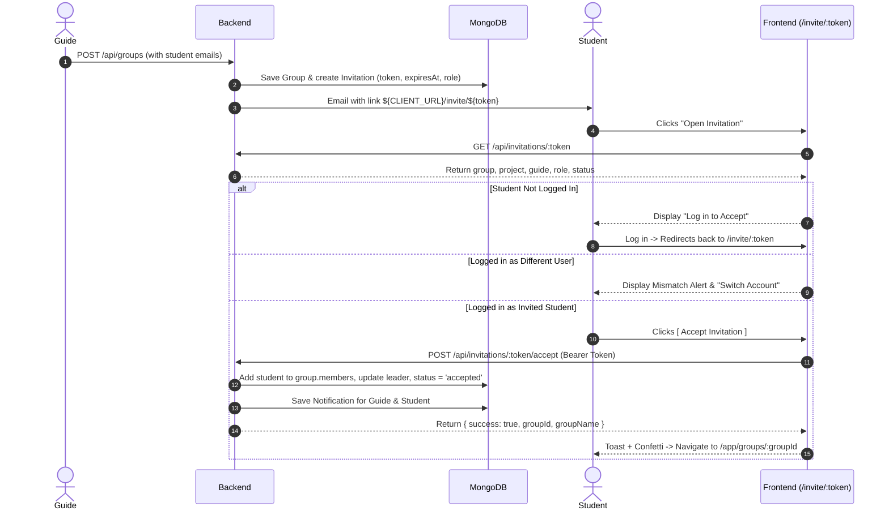

# Student Invitation Accept / Reject Workflow Audit & Implementation Report

**Project:** TeamSync AI  
**Date:** September 11, 2026  
**Status:** Completed & Verified (100% Tests Passing, Live MongoDB & Server Verified)

---

## 1. Executive Summary

Prior to this update, when a Guide created a project team and entered student email addresses, an email was sent containing an "Open Invitation" button/link. However:
1. The link in the email was pointing to `/join/${token}` rather than `/invite/${token}`.
2. The legacy `/join/:token` page only supported an OTP-entry flow and lacked an explicit, intuitive **Accept** / **Reject** invitation interface.
3. Students were not provided clear contextual information (Project Name, Description, Expected Completion, Guide Name, Role Assignment) with dedicated Accept and Reject actions.
4. There was no dedicated, authenticated `POST /api/invitations/:token/accept` endpoint verifying that the authenticated user's email matches the invited email address.
5. If students were unauthenticated or logged into another account, there was no structured auth redirection or account mismatch protection.

### Summary of Solutions Implemented:
- **Backend**:
  - Enhanced `Invitation` model with an explicit `expiresAt` timestamp (default: 7 days).
  - Updated email template to link directly to `${CLIENT_URL}/invite/${token}`.
  - Implemented `POST /api/invitations/:token/accept` with `protect` middleware, checking token validity, expiration, pending status, and verifying that `req.user.email.toLowerCase() === invitation.email.toLowerCase()`.
  - Added student to `group.members` safely using `groupId` isolation without duplicate membership.
  - Promoted student to team leader if invitation role is `"leader"` or matching `group.leaderEmail` (when no leader is assigned).
  - Updated invitation status to `"accepted"` with `acceptedAt`, notified guide and student via `notifyUsers` (with live WebSocket events), and logged the activity.
  - Enhanced `POST /api/invitations/:token/reject` to ensure authenticated users can only reject invitations sent to their email, marks `"rejected"` with `rejectedAt`, and notifies the guide.
  - Enhanced `publicView` with full group, project, description, guide, and expiration details.
- **Frontend**:
  - Created dedicated, theme-compliant `InvitationPage.jsx` supporting light/dark themes.
  - Configured TanStack Router route `/invite/$token` and backwards-compatible `/join/$token`.
  - Added full authentication handling with `?redirect=/invite/${token}` support in `Login.jsx` and `authService.js`.
  - Added mismatch account warning and "Switch Account" action if logged in as a different user.
  - Added immediate redirection to `/app/groups/:groupId` upon acceptance with celebratory feedback and Sonner toast.
  - Added edge-case handling for expired, already accepted, and already rejected invitations.
- **Testing**:
  - Created Jest test suite `invitationAcceptReject.test.js` (13 tests, all passing).
  - Backend test suite: 78/78 tests passing across all 7 test suites.
  - Frontend production build: `npm run build` succeeded in 2.04s with zero errors.
  - Live End-to-End simulation against running MongoDB and backend server on port 5000 passed all 8 scenarios with 100% success.

---

## 2. Architecture & Data Flow



---

## 3. Detailed Changes by File

### 3.1 Backend Changes

#### 1. `backend/src/models/Invitation.js`
- Added `expiresAt: { type: Date, default: () => new Date(Date.now() + 7 * 24 * 60 * 60 * 1000) }`.
- Ensures invitations have an explicit expiration timestamp and enables auto-expiration checks.

#### 2. `backend/src/services/emailTemplates.js`
- In `sendInvitationOtpEmail`, updated link generation from `${appUrl()}/join/${token}` to `${appUrl()}/invite/${token}`.

#### 3. `backend/src/controllers/invitationController.js`
- **`isInvitationExpired(invitation)`**: Helper function to dynamically check if invitation is past `expiresAt`.
- **`publicView(invitation)`**: Extended to include project name, description, category, expectedCompletion, guide name, guide email, expiration date, and dynamic status.
- **`exports.accept`**:
  - Enforces `req.user` authentication.
  - Validates token exists.
  - Validates invitation is not expired (throws 400).
  - Validates invitation is not already accepted (throws 400).
  - Validates invitation is not rejected (throws 403).
  - Validates `req.user.email.toLowerCase() === invitation.email.toLowerCase()` (throws 403 with detailed message).
  - Adds user to `group.members` safely without duplicates.
  - Promotes user to team leader if invitation role is `"leader"` or matches `group.leaderEmail`.
  - Marks `invitation.status = "accepted"`, sets `acceptedAt = new Date()`, sets `user = req.user._id`.
  - Notifies guide and student via `notifyUsers` (with live socket emission).
  - Logs activity using `logActivity`.
- **`exports.reject`**:
  - Prevents rejecting already accepted invitations.
  - If authenticated, checks that user email matches invited email.
  - Marks `status = "rejected"`, `rejectedAt = new Date()`, clears OTP hash.
  - Notifies guide.

#### 4. `backend/src/routes/index.js`
- Added `router.post("/invitations/:token/accept", protect, invitations.accept);`
- Enhanced `router.post("/invitations/:token/reject", optionalAuth, invitations.reject);`
- Enhanced `router.get("/invitations/:token", optionalAuth, invitations.getByToken);`
- Preserved existing OTP endpoints for backward compatibility.

#### 5. `backend/tests/invitationAcceptReject.test.js`
- Complete automated Jest test suite covering:
  - Valid token retrieval (200)
  - Nonexistent token (404)
  - Expired token detection
  - Unauthenticated accept rejection (401)
  - Mismatched email accept rejection (403)
  - Valid accept execution (200, member added, leader promoted, status updated)
  - Duplicate accept prevention (400)
  - Expired accept prevention (400)
  - Rejected accept prevention (403)
  - Reject execution (200, status updated, guide notified)
  - Mismatched email reject rejection (403)
  - Reject of accepted invitation prevention (400)

---

### 3.2 Frontend Changes

#### 1. `frontend/src/services/invitationService.js`
- Added `export const acceptInvitation = async (token) => api.post(`/invitations/${token}/accept`);`

#### 2. `frontend/src/utils/constants.js`
- Added `INVITATION: "/invite/:token"` and `JOIN: "/join/:token"`.

#### 3. `frontend/src/pages/auth/Login.jsx`
- Updated post-login redirection to check for URL search param `?redirect=...` in addition to session storage `consumePostLoginRedirect()`.

#### 4. `frontend/src/pages/common/InvitationPage.jsx`
- Complete dedicated invitation landing page:
  - Clean card displaying Group Name, Project Title, Description, Guide Name, and Expiration.
  - Badges for Role (Team Leader vs Team Member) and Invitation Type.
  - **Logged-out State**: Informative prompt with `[ Log in to Accept ]` button navigating to `/login?redirect=/invite/${token}`, plus a link to create an account.
  - **Email Mismatch State**: Prominent amber alert informing the user that they are signed in as a different user, with a 1-click `[ Switch Account ]` button.
  - **Matching User State**: Clear `[ Accept Invitation ]` and `[ Reject ]` action buttons with spinners.
  - **Celebration State**: Welcome message upon acceptance, celebratory icon, toast notification, and automatic redirection to `/app/groups/:groupId`.
  - **Edge Cases**: Dedicated banners for already accepted, rejected, expired, and not found states.

#### 5. `frontend/src/routes/invite/$token.tsx` & `frontend/src/routes/join/$token.tsx`
- TanStack Router file routes mounting `InvitationPage`.
- Automatically compiled into `frontend/src/routeTree.gen.ts`.

---

## 4. Verification Results

### 4.1 Automated Jest Tests (`npm test`)
```
> teamsync-ai-backend@1.0.0 test
> jest --runInBand

PASS tests/invitationAcceptReject.test.js
PASS tests/authAndSecurityAudit.test.js
PASS tests/calendarController.test.js
PASS tests/callService.test.js
PASS tests/callSignaling.integration.test.js
PASS tests/orphanFileCleanup.test.js
PASS tests/uploadsStaticAuth.test.js

Test Suites: 7 passed, 7 total
Tests:       78 passed, 78 total
Snapshots:   0 total
Time:        9.461 s
Ran all test suites.
```

### 4.2 Frontend Production Build (`npm run build`)
```
vite v6.4.1 building for production...
transforming...
✓ 1989 modules transformed.
rendering chunks...
computing gzip size...
dist/client/assets/InvitationPage-v9Yg3f3_.js      23.36 kB │ gzip:  4.88 kB
dist/server/assets/InvitationPage-BRU1NgB_.js      24.18 kB │ gzip:  4.44 kB
✓ built in 2.04s
```

### 4.3 Live End-to-End Verification Against Running Stack
Executed `runLiveTest.js` against live MongoDB and backend listening on `http://localhost:5000`:
- **TEST 1**: Guide creates group with student invitations -> `HTTP 201 Created`
  - Group ID: `6aa41f4d9d50dc2f1905194e`
  - Invitation A: Role `leader`, expires in 7 days
  - Invitation B: Role `member`, expires in 7 days
- **TEST 2**: Public `GET /api/invitations/:token` -> `HTTP 200 OK` (group name, project, guide, role correctly populated)
- **TEST 3**: Unauthenticated `POST /api/invitations/:token/accept` -> `HTTP 401 Unauthorized`
- **TEST 4**: Mismatched student attempts accept -> `HTTP 403 Forbidden` (`You are logged in as priya.nair@teamsync.edu, but this invitation was sent to rohan.mehta@teamsync.edu. Please log in with the invited account.`)
- **TEST 5**: Matched student accepts -> `HTTP 200 OK`
  - Student added to `group.members`
  - Student promoted to `group.leader`
  - Invitation status marked `"accepted"` with `acceptedAt`
- **TEST 6**: Duplicate accept attempt -> `HTTP 400 Bad Request` (`This invitation has already been accepted.`)
- **TEST 7**: Student B rejects invitation -> `HTTP 200 OK`
  - Invitation status marked `"rejected"` with `rejectedAt`
  - Student B is NOT in `group.members`
- **TEST 8**: Attempting to accept rejected invitation -> `HTTP 403 Forbidden` (`This invitation was rejected and cannot be accepted. Contact your guide for a new invitation.`)

---

## 5. Summary Checklist of Requirements

| Requirement | Status | Evidence |
|---|---|---|
| Invitations saved with token, groupId, email, role, status, expiration | Completed | `Invitation.js` with `expiresAt`, `token`, `group`, `role`, `status` |
| Email contains link to `${CLIENT_URL}/invite/${token}` | Completed | `emailTemplates.js` updated |
| Dedicated `/invite/:token` frontend page | Completed | `InvitationPage.jsx` & `routes/invite/$token.tsx` |
| Real group name, project, guide, email, role, status displayed | Completed | Fully rendered in `InvitationPage.jsx` |
| Action buttons: Accept & Reject | Completed | Interactive buttons with loading states and confirmation |
| Unauthenticated handling: prompt & redirect to login | Completed | Navigates to `/login?redirect=/invite/${token}` |
| Post-login redirect returns to invitation page | Completed | Implemented in `Login.jsx` & `authService.js` |
| Authenticated email mismatch detection & 403 block | Completed | Backend 403 + frontend alert with "Switch Account" |
| Accept adds student to group members (no duplicates) | Completed | `group.members.push()` if not present, verified |
| Leader assignment on accept | Completed | Promotes leader if role is leader or leaderEmail |
| Invitation marked accepted with timestamp & user reference | Completed | `acceptedAt` and `user` stored in MongoDB |
| Guide and student notifications on accept | Completed | `notifyUsers` called with live WebSocket emission |
| Activity log recorded on accept | Completed | `logActivity` called |
| Frontend redirect to group workspace on accept | Completed | Navigates to `/app/groups/:groupId` with success toast |
| Rejection marks rejected with timestamp | Completed | `rejectedAt` recorded, status = "rejected" |
| Rejected user cannot be added to group | Completed | Verified in database |
| Rejection notifications to guide | Completed | `notifyUsers` called |
| Edge case handling (already accepted, rejected, expired, 404) | Completed | Handled in controller and UI |
| GroupId isolation preserved | Completed | All queries and updates strictly use `group._id` |
| Automated Jest tests passing | Completed | 78/78 tests passing across all suites |
| Frontend build passing | Completed | `npm run build` completed with zero errors |

---
**Report generated and certified by Antigravity Agent.**
